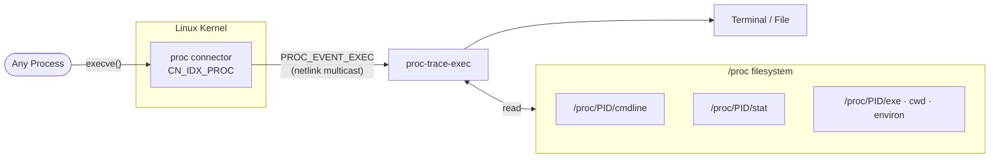
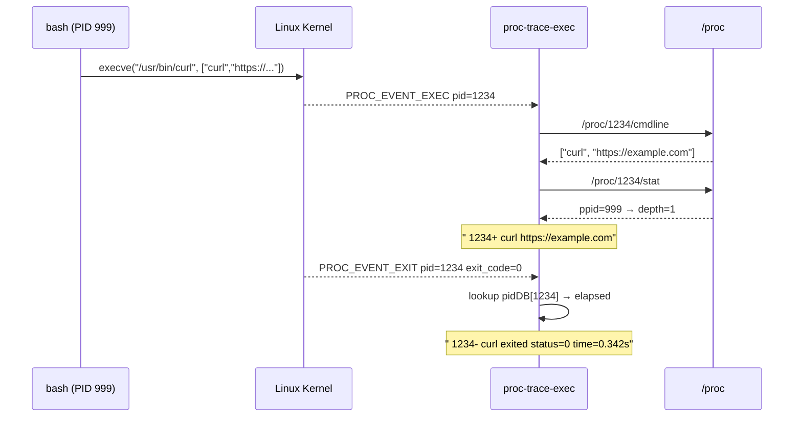

<div align="center">
  
  <h1>proc-trace-exec</h1>
  <p><strong>See every <code>exec()</code> call on your Linux system — in real time, with process tree indentation, exit status, and timing.</strong></p>

  
  
  
  
</div>

---

`proc-trace-exec` listens to the Linux kernel's [proc connector](https://www.kernel.org/doc/html/latest/driver-api/connector.html) via a netlink socket and prints a line every time any process calls `exec()`. No eBPF, no `ptrace`, no kernel module — just a netlink socket and `/proc`.

<div align="center">
  
</div>

---

## Features

- **System-wide**: every `exec()` on the machine, not just your shell's children
- **Process tree**: indented output shows who spawned what
- **Exit timing** (`-t`): exit status + wall-clock runtime for every process
- **User / CWD / env** (`-u`, `-d`, `-e`): attach context to each event
- **Subtree filter** (`-p PID`): watch only descendants of one process
- **CMD mode**: `proc-trace-exec CMD...` runs a command and traces only its subtree
- **Single static binary**, zero runtime dependencies



---

## Requirements

- Linux kernel with `CONFIG_CONNECTOR=y` and `CONFIG_PROC_EVENTS=y` (default on all major distros)
- Root or `CAP_NET_ADMIN`

---

## Build

### Docker — no local Go install needed

```bash
chmod +x build.sh
./build.sh
# → binaries in ./dist/
#   proc-trace-exec-linux-amd64
#   proc-trace-exec-linux-arm64
```

### From source

```bash
go build -o proc-trace-exec .
```

### Static binary

```bash
CGO_ENABLED=0 go build -ldflags="-s -w" -o proc-trace-exec .
```

---

## Usage

```
proc-trace-exec [-deflqQtu] [-o FILE] [-p PID | CMD...]
```

### Watch everything system-wide

```bash
sudo proc-trace-exec
```

### Trace a command and all of its children

```bash
sudo proc-trace-exec -t sh -c 'find /etc -name "*.conf" | head -3'
```

```
32741+ sh -c 'find /etc -name "*.conf" | head -3'
  32742+ find /etc -name '*.conf'
  32743+ head -3
/etc/host.conf
/etc/nsswitch.conf
/etc/resolv.conf
  32743- head exited status=0 time=0.001s
  32742- find exited status=141 time=0.003s
32741- sh exited status=0 time=0.006s
```

### Watch only the subtree of an existing process

```bash
sudo proc-trace-exec -p $(pgrep dockerd)
```

### Show user, working directory, and full executable path

```bash
sudo proc-trace-exec -u -d -l
```

```
95100+ <root> /root % /usr/sbin/sshd
  95101+ <root> /root % /usr/sbin/sshd
    95102+ <rick> /home/rick % /bin/bash
```

### Log every exec to a file

```bash
sudo proc-trace-exec -Q -o /var/log/execs.log &
```

### Flat output — no indentation, good for grep

```bash
sudo proc-trace-exec -f | grep python
```

---

## Flags

| Flag | Description |
|------|-------------|
| `-d` | Print working directory of each process |
| `-e` | Print environment variables of each process |
| `-f` | Flat output — no indentation |
| `-l` | Print full executable path (via `/proc/pid/exe`) |
| `-o FILE` | Write output to FILE instead of stdout |
| `-p PID` | Only trace descendants of PID |
| `-q` | Suppress arguments — show executable name only |
| `-Q` | Suppress error messages (e.g. vanished processes) |
| `-t` | Show exit status and wall-clock runtime per process |
| `-u` | Print owning user of each process |

---

## Output format

```
[indent]PID[+/-] [<user>] [cwd % ] argv...
```

- `+` after PID — exec event (process started a new image)
- `-` after PID — exit event (only with `-t`)
- Indentation — 2 spaces per depth level in the process tree
- `status=N` — process exited with code N
- `signal=SIGNAME` — process was killed by a signal

---

## How it works

Linux exposes process lifecycle events via the proc connector — a netlink socket (`AF_NETLINK` / `NETLINK_CONNECTOR`, multicast group `CN_IDX_PROC`). Any process holding `CAP_NET_ADMIN` can subscribe with `PROC_CN_MCAST_LISTEN` and receive kernel events for every `fork()`, `exec()`, and `exit()` system-wide.





On each `PROC_EVENT_EXEC`:

1. Read `/proc/<pid>/cmdline` for the full argument vector
2. Read `/proc/<pid>/stat` to find the parent PID and compute tree depth
3. Optionally read `/proc/<pid>/exe` (full path), `/proc/<pid>/cwd`, `/proc/<pid>/environ`, `/proc/<pid>/status` (uid)
4. Print the formatted line with depth-based indentation

On `PROC_EVENT_EXIT` (with `-t`): compute wall-clock elapsed time using the kernel's `timestamp_ns` from the event header, then print the exit line and remove the PID from the internal table.

The depth of a process in the tree is computed lazily by walking the `/proc/pid/stat` parent chain until reaching `watchPID` (default: PID 1, i.e. all processes). Results are cached in a `map[int32]*pidEntry` for subsequent events on the same PID.
